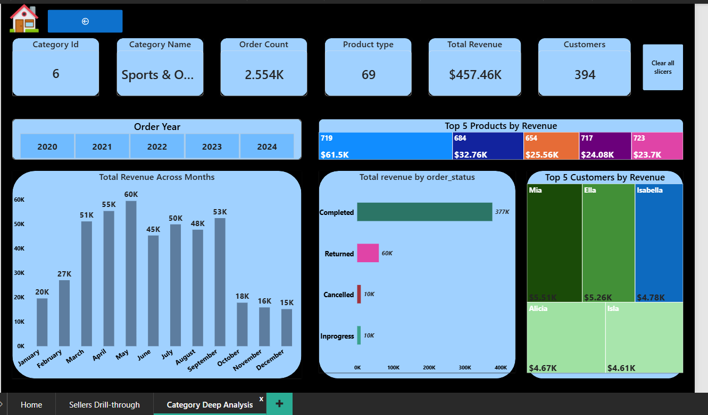

# Amazon PowerBi Report

## Amazon E-Commerce Sales Analysis | Power BI

### 📊 Project Overview

An interactive **Amazon E-Commerce Business Intelligence Report** built in Microsoft Power BI to analyze sales performance across products, categories, sellers, customers, order status, and time.

The report transforms transactional sales data into an interactive analytical solution that allows users to monitor KPIs, identify sales trends, compare performance, and drill down into specific sellers and product categories.

---

## 🎯 Business Objective

The objective of this project is to analyze Amazon's e-commerce sales data and answer key business questions:

- How is overall revenue and order performance changing over time?
- Which product categories contribute the most revenue?
- Which sellers generate the highest revenue?
- Which products are driving category performance?
- How are orders distributed across different statuses?
- Which customers contribute the most revenue?
- How does performance vary across different years and months?
- What insights can be generated at seller and category level?

---

## 📌 Dashboard Pages

### 1. Home — Sales Overview

The main dashboard provides a high-level view of Amazon's business performance.

**Key KPIs**

- Total Revenue — **$12.64M**
- Total Orders — **21.63K**
- Quantity Sold — **42K**
- Products Sold — **750**
- Customers — **898**
- Sellers — **54**
- Completed Orders — **18K**
- Average Order Quantity — **1.93**

**Analysis Included**

- Revenue by product category
- Customer distribution by order status
- Order-year analysis
- Seller filtering
- Revenue performance
- Order-status analysis
- Interactive slicers

### 2. Seller's Drill-through

A dedicated drill-through page allows users to select an individual seller and analyze their performance in detail.

**Seller-level KPIs**

- Seller Origin
- Seller Name
- Seller ID
- Total Revenue
- Most Expensive Order
- Products Sold
- Customers

**Seller Analysis**

- Monthly revenue trends
- Yearly revenue distribution
- Year-over-year revenue growth
- Running revenue contribution
- Monthly order performance
- Category-level filtering
- Customer analysis

This allows users to move from **overall business performance → individual seller performance**.

### 3. Category Deep Analysis

The category drill-through page provides detailed analysis of individual product categories.

**Category-level KPIs**

- Category ID
- Category Name
- Order Count
- Product Type
- Total Revenue
- Customers

**Category Analysis**

- Revenue across months
- Top 5 products by revenue
- Revenue by order status
- Top 5 customers by revenue
- Year-level filtering
- Category selection
- Clear-slicer functionality

---

## 🔍 Key Insights

The report enables analysis of several important business patterns:

- Revenue trends and changes across years and months
- Differences in revenue contribution across product categories
- Seller-level revenue and customer performance
- Top revenue-generating products within categories
- Distribution of completed, returned, cancelled, and in-progress orders
- High-value customer contribution

---

## 🛠️ Tools & Technologies

- **Microsoft Power BI**
- **DAX**
- **Power Query**
- **Data Modeling**
- **Data Visualization**
- **Business Intelligence**
- **Interactive Reporting**

---

## 🧮 DAX & Analytical Techniques

The report uses DAX measures to create dynamic business KPIs and analytical calculations.

Techniques used include:

- `CALCULATE()`
- `SUM()`
- `SUMX()`
- `COUNTROWS()`
- `DISTINCTCOUNT()`
- `FILTER()`
- `ALL()`
- `ALLEXCEPT()`
- `VALUES()`
- Time-intelligence calculations
- Running totals
- Year-over-year growth
- Revenue contribution
- Dynamic KPI calculations
- Dynamic filter context

---

## 🏗️ Power BI Features Used

- Interactive slicers
- Cross-filtering
- Drill-through pages
- Bookmarks
- Clear-filter functionality
- Dynamic KPI cards
- Interactive report navigation
- Time-based analysis
- Category and seller analysis

---

## 📷 Dashboard Preview

### 🏠 Home — Sales Overview

### 👤 Seller's Drill-through

### 📦 Category Deep Analysis

---

## 💡 Business Value

This project demonstrates how transactional e-commerce data can be converted into an interactive decision-support solution.

The report enables users to:

- Monitor overall business performance
- Identify high-performing categories
- Evaluate seller performance
- Analyze product contribution
- Identify high-value customers
- Track revenue trends
- Understand order outcomes
- Drill down from high-level KPIs to detailed business performance

The analytical workflow is:

**Raw Data → Analysis → Insights → Business Decisions**

---

## 🎓 Skills Demonstrated

### Data Analysis

- KPI development
- Trend analysis
- Revenue analysis
- Performance comparison
- Customer analysis
- Product analysis
- Seller analysis

### Power BI

- DAX
- Power Query
- Data Modeling
- Interactive dashboards
- Drill-through
- Bookmarks
- Slicers
- Cross-filtering
- Dynamic KPIs

### Business Intelligence

- Business problem identification
- Data-driven analysis
- Performance monitoring
- Interactive decision support
- Insight generation

---

## 🚀 Project Outcome

The final report provides a multi-level analytical view of Amazon's e-commerce business.

Users can start with the **overall sales dashboard**, identify an area of interest, and then drill into **seller-level or category-level performance** for deeper analysis.

**Overall Performance → Identify Driver → Drill Down → Analyze → Generate Insight**

---

## 👤 Author

### Chitransh Jain

Aspiring Data Analyst | Business Analyst

**Skills:** SQL | Power BI | DAX | Excel | Python | Data Analysis | Business Intelligence
